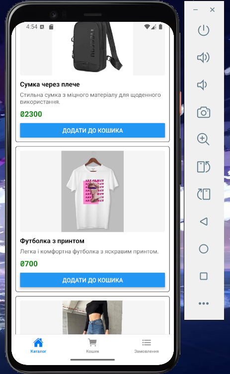
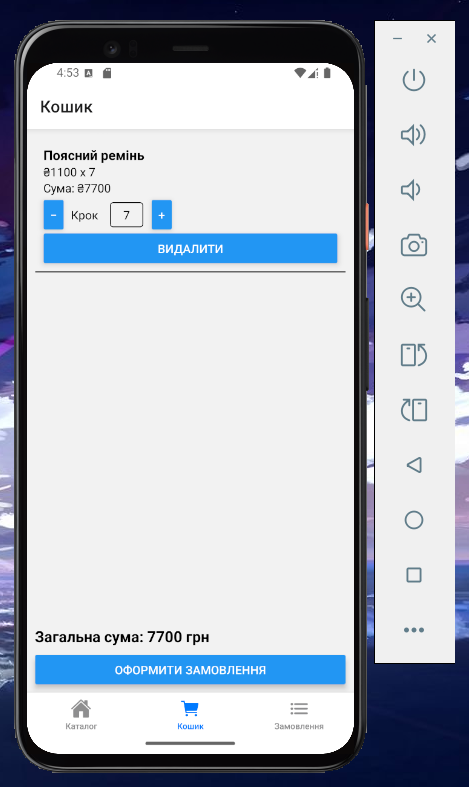
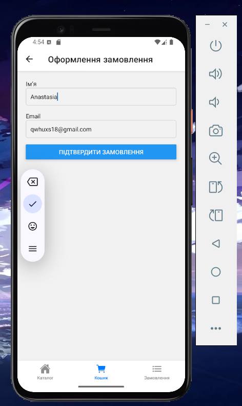
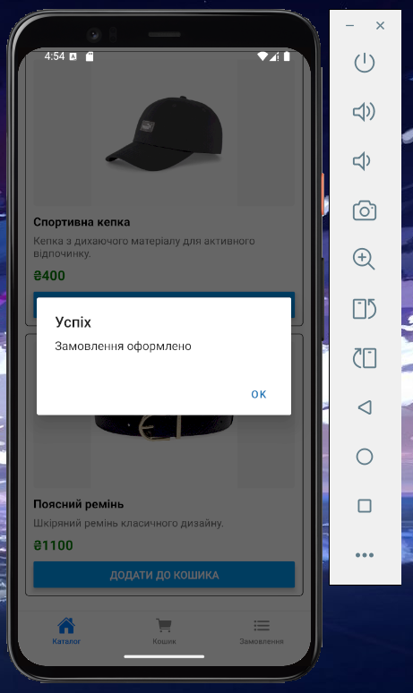
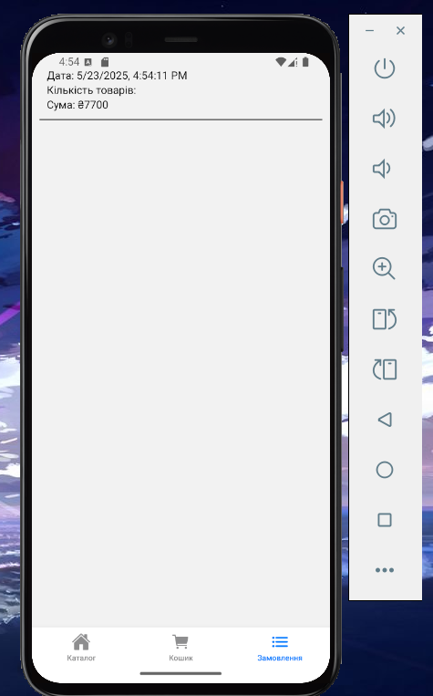

# ЛАБОРАТОРНА РОБОТА №8

## Тема:
**ВИКОРИСТАННЯ REDUX TOOLKIT ДЛЯ УПРАВЛІННЯ СТАНОМ ПРИ РОЗРОБЦІ МОБІЛЬНИХ ЗАСТОСУНКІВ**

## Мета:
Навчитися керувати глобальним станом у React Native-додатку, використовуючи **Redux Toolkit**, реалізувавши повний флоу інтернет-магазину.

---

## Функціональність застосунку:

### Каталог товарів

- Вивід переліку товарів (зображення, назва, опис, ціна)
- Можливість додати товар до кошика

**Скрін:**

---

### Кошик

- Зберігаються всі додані товари (зберігається стан навіть після перезапуску завдяки `redux-persist`)
- Вивід кількості одиниць, загальної суми
- Можливість змінити кількість товару або видалити його
- Підрахунок загальної суми замовлення
- Кнопка **"Оформити замовлення"** відкриває форму

**Скрін:**

---

### Оформлення замовлення

- Форма із двома полями: ім’я та email
- Базова валідація
- Після успішного оформлення:
  - Кошик очищується
  - Дані записуються в історію
  - Виводиться повідомлення про успішне оформлення

**Скріншоти:**

---

### Історія замовлень

- Окремий екран зі списком усіх оформлених замовлень
- Вивід: дата, кількість товарів, сума
- Дані зберігаються в `AsyncStorage` і завантажуються автоматично при запуску застосунку

**Скрін:**

---

## Автор
Козік Анастасія ВТк-24-1
